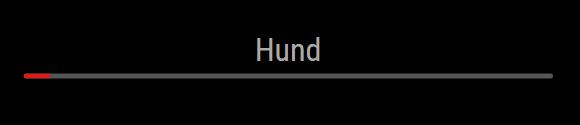

[](https://raw.githubusercontent.com/fewieden/MMM-VocabularyTrainer/master/LICENSE) [](https://travis-ci.org/fewieden/MMM-VocabularyTrainer) [](https://codeclimate.com/github/fewieden/MMM-VocabularyTrainer) [](https://snyk.io/test/github/fewieden/mmm-vocabularytrainer) [](https://doclets.io/fewieden/MMM-VocabularyTrainer/master)

# MMM-VocabularyTrainer

Vocabulary Trainer Module for MagicMirror²

## Examples



## Dependencies

* An installation of [MagicMirror<sup>2</sup>](https://github.com/MichMich/MagicMirror)

## Installation

1. Clone this repo into `~/MagicMirror/modules` directory.
1. Configure your `~/MagicMirror/config/config.js`:

    ```
    {
        module: "MMM-VocabularyTrainer",
        position: "top_right",
        config: {
            ...
        }
    }
    ```

## Config Options

| **Option** | **Default** | **Description** |
| --- | --- | --- |
| `provider` | `"custom"` | API provider (See full list below). |
| `nativeTimeout` | `10 * 1000 (10secs)` | Display time of native word. |
| `foreignTimeout` | `20 * 1000 (20secs)` | Display time of foreign word. |
| `showTimeLeft` | `true` | Display countdown bar. |
| `revert` | `false` | Revert display order of native and foreign words. |
| `color` | `false` | Use color for the countdown bar. |
| `width` | `'100%'` | Width of the countdown bar. |

## Provider

### custom (ALL <-> ALL)

Loads dictionairy from `MagicMirror/modules/MMM-VocabularyTrainer/public/MMM-VocabularyTrainer.json`.
There is a sample file provided in this directory as well, to use it you have to do:

1. Change directory `cd ~/MagicMirror/modules/MMM-VocabularyTrainer/public` directory.
1. Copy file `cp MMM-VocabularyTrainer.json.sample MMM-VocabularyTrainer.json`.

### geschichtsvereinkoengen (LATIN <-> GERMAN)

Shows latin sayings and their german translations from [Geschichts- und Kulturverein Köngen e.V. ](http://geschichtsverein-koengen.de/RoemSprichwort.htm).

To use this API you have to set the provider in config as `provider: 'geschichtsvereinkoengen'`
To revert the displaying order from latin -> german to german -> latin you have to add `revert: true` to your config.

## Developer

* `npm run lint` - Lints JS and CSS files.
* `npm run docs` - Generates documentation.

### Documentation

The documentation can be found [here](https://doclets.io/fewieden/MMM-VocabularyTrainer/master).

### API Provider Development

If you want to add another API provider checkout this [Guide](apis).
